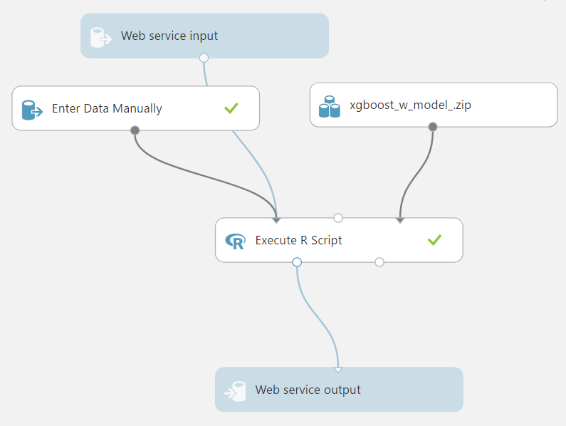

# Batch Fault Detection

This project uses a combination of machine learning and IoT messaging to monitor the progress of penicillin drug production batches. 

The original simulated batch data are from this repository [https://kuleuven.app.box.com/v/batchbenchmark/4/3864480711](https://kuleuven.app.box.com/v/batchbenchmark/4/3864480711). The data were originally published as

Jan Van Impe, Geert Gins, __An extensive reference dataset for fault detection and identification in batch processes__,  
*Chemometrics and Intelligent Laboratory Systems*, Volume 148, 15 November 2015, Pages 20–31.

The overall project is described in [this presentation](/docs/LegacyDataAnalyticsDemo.pptx) which is covered in [this short video of the talk](https://youtu.be/HGm170ZoskM).

# Machine Learning
## Data Download

I downloaded four sets of data to work with from the original repository:

* `Aligned_set_1_BASE_NOC` - a set of "normal" batch data without faults
* `Aligned_set_1_BASE_fault_1` - a set of data that has a sudden change in feed substrate concentration
* `Aligned_set_1_BASE_fault_9` - a set of data that has non-function pH control
* `Aligned_set_1_BASE_fault_11` - a set of data that has reactor temperature sensor drift

The data were unzipped and saved in directories in the base (`/`) folder.

## Data Exploration and Pre-Processing

I explore the structure of the HDF5 files, the shape and type of data available, and the range of the variables in a notebook: [`Batch_Data_Explore_and_prep`](src/Batch_Data_Explore_and_prep.ipynb)

This output a set of data into two place:
1. 10 random runs from each of the four data sets saved as `.csv` files in the `/data` folder.
2. 10 random runs with only 10 points per run saved as `.csv` files in the `/datasample` folder.

It also outputs a figure showing sample data from four of the normal runs: `/docs/normaldata.png`.

## Model Training

I used the XGBoost model trained on a sample of the data [`Batch_data_training`](/src/Batch_data_training.ipynb). The model was saved in binary format in the root folder: `0002.model`. The training progress was copied into a separate file [`TrainingRecord`](/src/TrainingRecord.xlsx) and then [plotted to visulaize the progress.](/docs/xgboost_training_record.png)

## Model Testing

I test the saved model using an R Markdown notebook: [`Test_R_Script`](src/Test_R_Script.Rmd). The notebook plots the results from two runs (one normal, one fault) and saves them as `/docs/testresults.png`. The final prediction algorithm is then ported to an R script that can be consumed by the Azure ML Studio: [`Azure_Script`](src/Azure_Script.r).

# IoT Monitoring

## IoT Simulated Device

I built a node-red flow to simulate an IoT device: [`node-red-iot-device`](src/node-red-iot-device.json). This flow reads in a random file from the `datasamples` directory, formats the data for sending to an Azure IoT hub, then sends the message. 

The message format is documented in the [`message_format`](docs/message_format.json) file. The message contains the `deviceID`, the connection `key` for the Azure IoT Hub, and the measurement data from the batch (including the two prior points), and a `batchID` that describes which batch the data belong to.

## Azure IoT Hub

I configured an Azure IoT Hub to receive the messages from the simulated device. The hub connection strings and devices are set through both `portal.azure.com` and the [Azure IoT Device Explorer](https://github.com/Azure/azure-iot-sdk-csharp/tree/master/tools/DeviceExplorer).

## Azure Stream Analytics (ASA)

Next, the data from the IoT Hub are consumed by an ASA job. This job reads the data from the messaging endpoint, "batchdata" consumer group from the IoT Hub. The job then pulls a prediction from an Azure ML Studio web app, then sends the data to both an Azure Blob storage endpoint and a PowerBI streaming endpoint.

The ASA job uses a function to get the prediction with the following signature:

>batchcheck ( Time FLOAT , Fermentation volume FLOAT , Dissolved oxygen concentration FLOAT , Dissolved CO2 concentration FLOAT , Reactor temperature FLOAT , pH FLOAT , Feed rate FLOAT , Feed temperature FLOAT , Agitator power FLOAT , Cooling/heating medium flow rate FLOAT , Cumulative base flow FLOAT , Cumulative acid flow FLOAT , Fermentation volume prior1 FLOAT , Dissolved oxygen concentration prior1 FLOAT , Dissolved CO2 concentration prior1 FLOAT , Reactor temperature prior1 FLOAT , pH prior1 FLOAT , Feed rate prior1 FLOAT , Feed temperature prior1 FLOAT , Agitator power prior1 FLOAT , Cooling/heating medium flow rate prior1 FLOAT , Cumulative base flow prior1 FLOAT , Cumulative acid flow prior1 FLOAT , Fermentation volume prior2 FLOAT , Dissolved oxygen concentration prior2 FLOAT , Dissolved CO2 concentration prior2 FLOAT , Reactor temperature prior2 FLOAT , pH prior2 FLOAT , Feed rate prior2 FLOAT , Feed temperature prior2 FLOAT , Agitator power prior2 FLOAT , Cooling/heating medium flow rate prior2 FLOAT , Cumulative base flow prior2 FLOAT , Cumulative acid flow prior2 FLOAT ) RETURNS FLOAT

The function is consumed in the ASA query with the script in [`ASAQuery`](/src/ASAQuery.sql). Note that the outputs are cast to floats, as some of the messages coming from the input stream are strings (in scientific notation).

## Azure Machine Learning Studio

The predictions from the ASA job are acquired by a trained model from Azure ML Studio, deployed as a web app. The ML Studio has a simple format that combines the pre-trained model with the input stream using the R [`Azure_Script`](src/Azure_Script.r). 

The trained model and the XGBoost libraries are contained in the `xgboost_w_model_.zip` archive. This was loaded to the Azure ML Studio as a dataset and then connected to the R script.

## Azure Blob Storage

The data with predictions are stored in Azure Blob storage as `.csv` files. The files are partitioned by date in a nested folder structure.

## PowerBI Stream

Finally, the data and predictions are monitored with a PowerBI dashboard. 

# Node-Red Stack

An alternative to using the Azure stack is to use a hybrid on-site Python/Node-Red setup. This utilizes a slightly modified version of the IoT node-red flow. Instead of sending a key to the Azure IoT server, it sends a timestamp along with the device name.

There are two different versions of the node-red flow (running on the Raspberry Pi):

1. [`node-red-iot-device`](/iot/node-red-iot-device.json) that is manually triggered to send data to the listening MQTT server on the Windows host machine
2. [`node-red-gpio-device`](/iot/node-red-gpio-device.json) that does the same thing, but also has a GPIO pushbutton to trigger the flow and a GPIO LED that blinks every time there is an output message sent.

## Server Requirements
* Python 3.5
* Flask server (`conda install flask` from an administrator Git Bash)

## Source

There are two files that work with the flask server:

1. [`Test_Flask_Server`](/src/Test_Flask_Server.ipynb) that walks through setting up the prediction server
2. [`Flask_server`](/src/Flask_server.py) that runs the flask server in the background.

In order to run the server, open a `Git Bash` in the `/src` directory and run `python Flask_server.py`. This runs the server on localhost using Port `5000`.

## Node-Red consumption

The node-red flow now consumes the flask endpoint, getting predictions for each of the data points in the flow. The flow then sends the data to dashboard plots where an end user can monitor the batch process. The server flow is [`node-red-server-plots`](/iot/node-red-server-plots.json).

## Establishing Connection between Raspberry Pi and a Local Server

Instruction on how to establish the connection between the Raspberry Pi and a local windows server are detailed in [this Readme](/iot/README.md).